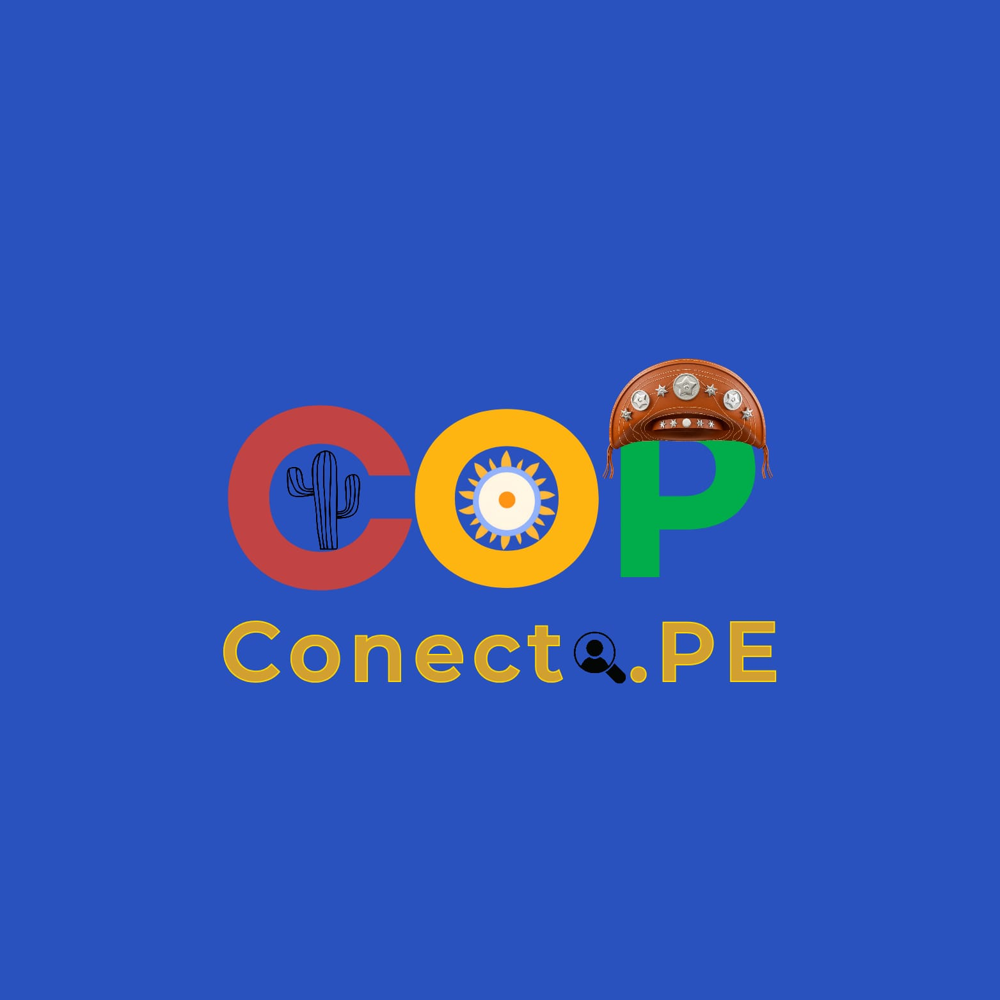
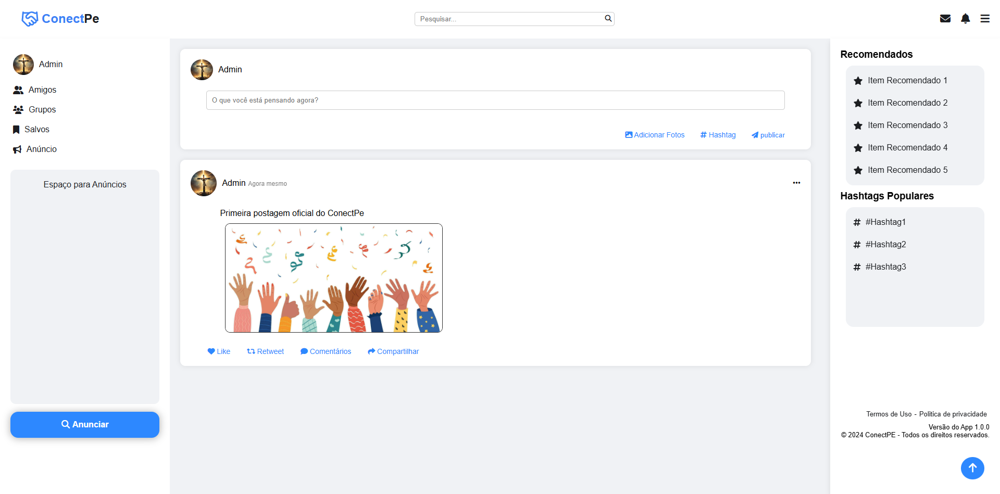

  <h1 align="center">ConectPe</h1>

Bem-vindo ao **ConectPe**! Este é um protótipo de uma rede social web que tem como objetivo conectar empresas que oferecem vagas de emprego a pessoas em busca de oportunidades. O ConectPe facilita a empregabilidade ao eliminar processos tradicionais, como entrega de currículos físicos e entrevistas presenciais. Além disso, promove a visibilidade de empresas e profissionais.

 ## Badges

## Navegação Rápida
- [Descrição do Projeto](#descrição-do-projeto)
- [Funcionalidades](#funcionalidades)
- [Funcionalidades Futuras](#funcionalidades-futuras)
- [Estrutura do Projeto](#estrutura-do-projeto)
- [Como Rodar o Projeto](#como-rodar-o-projeto)
- [Roadmap de Desenvolvimento](#roadmap-de-desenvolvimento)
- [Tecnologias Utilizadas](#tecnologias-utilizadas)
- [Imagens do Projeto](#imagens-do-projeto)
- [Licença](#licença)

---

## Descrição do Projeto
O **ConectPe** conecta empregadores e candidatos de forma prática e eficiente. Com um perfil personalizável, postagem de conteúdos e interação entre usuários, o protótipo utiliza tecnologias modernas para garantir uma experiência intuitiva e funcional.

---

## Funcionalidades
- Cadastro e login de usuários com autenticação via e-mail (token).
- Edição de perfil (foto de perfil, nome de usuário, biografia e links).
- Postagem de textos com ou sem fotos.
- Exclusão de posts.
- Acesso ao perfil de outros usuários.

---

## Funcionalidades Futuras
- Interações com posts: curtir, retweet, comentários e compartilhamento.
- Sistema de chat entre usuários.
- Implementação de hashtags e exibição das hashtags mais populares.
- Sistema de recomendações baseado em curtidas e retweets.
- Sistema de notificações.
- Pesquisa avançada por assuntos (hashtags, posts e usuários relacionados).
- Sistema de anúncios pagos, com planos semanais e benefícios adicionais.

---

## Estrutura do Projeto
- **index.php**: Verifica se o usuário está logado e redireciona para a página principal ou tela de login.
- **user/**: Contém arquivos que permitem a interação dos usuários com o sistema.
- **src/**: Classes para envio de e-mails, utilizando a biblioteca [PHPMailer](https://github.com/PHPMailer/PHPMailer) (créditos ao criador).
- **responsive/**: Arquivos que melhoram a usabilidade.
- **posts/**: Gerencia postagens (criação e exclusão), com subpasta `post-img/` para armazenamento de imagens.
- **Midia/**: Armazena fotos de perfil dos usuários e ícones do projeto.
- **css/**: Contém os arquivos de estilo das páginas.
- **core/**: Valida informações e gerencia a conexão com o banco de dados.
- **policy.html**: Política de Privacidade.
- **terms.html**: Termos de Uso.

---

## Como Rodar o Projeto
1. Certifique-se de ter o [XAMPP](https://www.apachefriends.org/) ou outro servidor local configurado.
2. Inicie os serviços **Apache** e **MySQL** no painel de controle do XAMPP.
3. No **PHPMyAdmin**:
   - Crie um banco de dados com o nome `conectpe`.
   - Importe o arquivo `conectpe.sql` disponível no projeto.
4. No navegador, acesse: `http://localhost/ConectPe`.
5. Cadastre-se na plataforma e explore todas as funcionalidades disponíveis.

---

## Roadmap de Desenvolvimento
### Fase 1: Lançamento Inicial
- Implementação do cadastro e login de usuários.
- Sistema de criação e edição de perfis.
- Postagem de textos e imagens.
- Configuração do banco de dados.
- Testes iniciais e correção de bugs críticos.
- **Status:** ✅ Concluído.

### Fase 2: Funcionalidades Avançadas
- Adicionar interações com posts.
- Planejamento das funcionalidades de chat, hashtags, e sistema de recomendações.
- **Status:** 🕒 Em andamento.

### Fase 3: Melhoria e Otimização
- Sistema de notificações.
- Pesquisa avançada por assunto.
- Sistema de anúncios.
- Otimização de código e desempenho.
- **Status:** 🛠️ Em planejamento.

### Fase 4: Lançamento Final
- Testes finais.
- Documentação de uso e manutenção.
- Preparação para o lançamento público.
- **Status:** 🛠️ Em planejamento.

---

## Tecnologias Utilizadas
- **Front-end**: HTML, CSS, JavaScript.
- **Back-end**: PHP 8.2.12.
- **Banco de Dados**: MySQL.
- **Servidor Local**: XAMPP.
- **Bibliotecas**:
  - [PHPMailer](https://github.com/PHPMailer/PHPMailer).

---

## Licença
Este projeto está licenciado sob a **MIT License**. Para mais detalhes, consulte o arquivo `LICENSE`.

---
